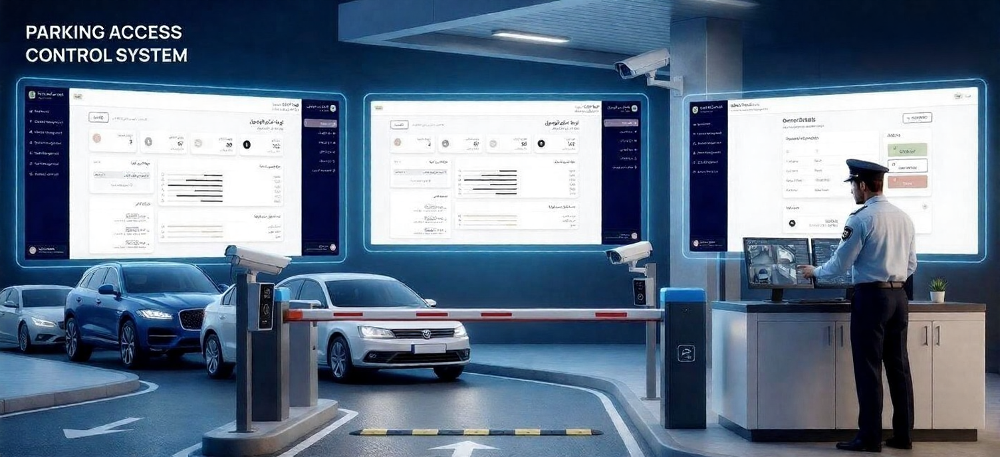
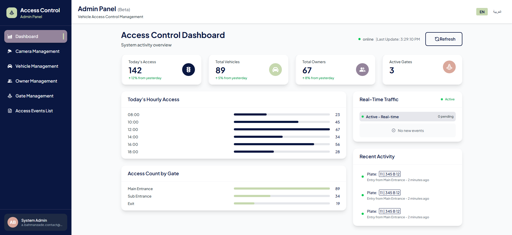
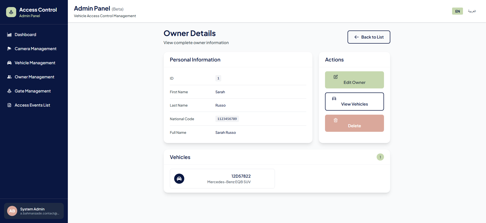

# 🚗 CarAccessControl (Parking & LPR System)


**CarAccessControl** is a comprehensive, modern solution for automated parking management and vehicle access control using License Plate Recognition (LPR). Built with performance and scalability in mind, it leverages **.NET 9** for a robust backend and **React.js** for a dynamic, multi-lingual frontend.

---

## 📸 Screenshots

| English | Arabic 
|:---:|:---:
|  | 
|  | 
---

## 🌟 Key Features

*   **🤖 AI-Powered LPR:** Seamless integration with AI models for accurate license plate recognition from camera feeds.
*   **⚡ Real-time Monitoring:** Instant updates on the dashboard using **SignalR** when a car approaches or enters.
*   **🌍 Multi-lingual Support:** Complete UI localization (English & Arabic) using **i18next**.
*   **📊 Advanced Reporting:** Generate detailed Excel reports of traffic logs using **ClosedXML**.
*   **🛡️ Robust Validation:** Clean and maintainable validation logic via **FluentValidation**.
*   **📷 Image Processing:** Handling camera snapshots and image manipulation with **OpenCvSharp4**.
*   **RESTful API:** Well-structured API endpoints following REST principles.

---

## 🏗️ Architecture & Tech Stack

This project is designed as a decoupled system where the backend handles logic and hardware integration, while the frontend provides a responsive interface.

### Backend (.NET 9)
*   **Framework:** ASP.NET Core (.NET 9)
*   **Database:** PostgreSQL (with Entity Framework Core)
*   **Real-time Communication:** SignalR
*   **Object Mapping:** AutoMapper
*   **Validation:** FluentValidation
*   **Reporting:** ClosedXML
*   **Image Processing:** OpenCvSharp4
*   **AI Integration:** Consumes an external AI Model API for plate recognition.

### Frontend (React.js)
*   **Framework:** React 18
*   **Language:** JavaScript/TypeScript
*   **Localization:** i18next (English / Arabic)
*   **State Management:** Context API
*   **Styling:** Tailwind CSS

---

## 🔄 How It Works (The Flow)

1.  **Capture:** The IP Camera captures an image of the vehicle at the gate.
2.  **Process:** The backend receives the image and processes it via **OpenCvSharp4**.
3.  **Recognition:** The image is sent to the **AI Model** service.
4.  **Result:** The AI returns the recognized license plate text.
5.  **Real-time Alert:** The result (Plate Number + Access Status + Photo) is pushed instantly to the Frontend via **SignalR**.
docker-compose up --build
```

---

## 📄 License  

Distributed under the MIT License. See LICENSE for more information.
